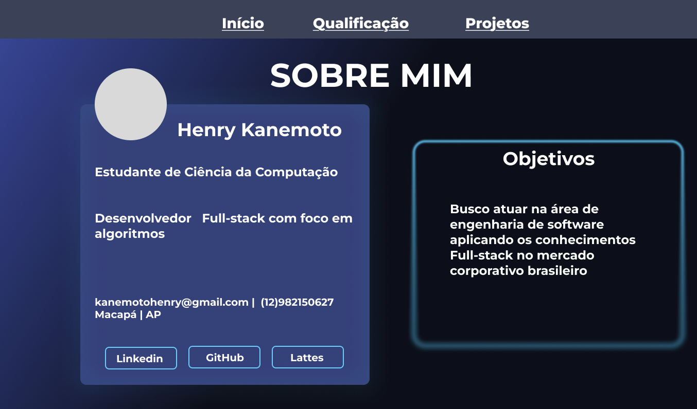
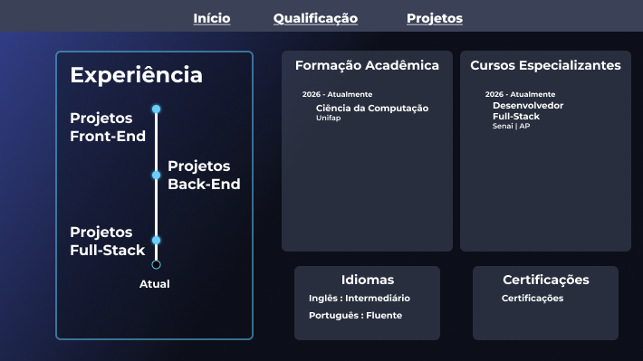
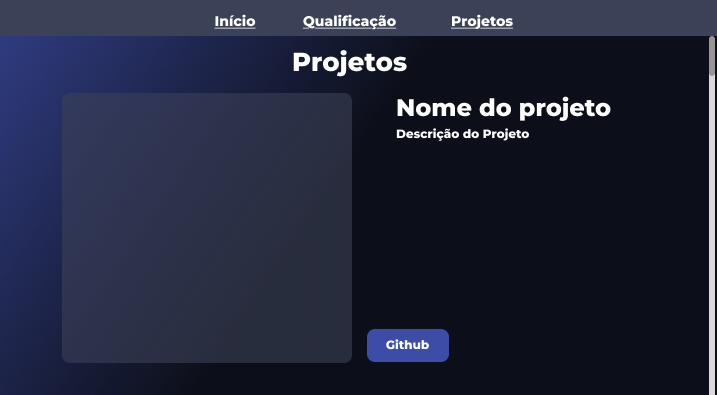

# Protótipo de Portfólio Profissional

Protótipo navegável de um portfólio profissional desenvolvido no Figma e documentado no GitHub.

## 🔗 Link do Protótipo
Acesse o protótipo interativo no Figma:
* [Link do Protótipo no Figma](https://www.figma.com/design/Gny24nHLHwiaGEhnbPJYnI/Untitled?node-id=0-1&t=gaOAIrDO1YBk4Gh1-1)

---

## 📸 Capturas de Tela

### Tela 1: Home / Apresentação

### Tela 2: Projetos / Sobre Mim

### Tela 3: Contato

---

## 🛠️ Ferramentas Utilizadas
* **Figma** - Prototipagem e design da interface (UI/UX).
* **IAs Generativas** - Auxílio na estruturação da documentação e geração de ideias.
* **GitHub** - Hospedagem e controle de versão do repositório.

---

## 👤 Autoria e Contato
Desenvolvido por **Henry Kanemoto Fukuoka**

* **GitHub:** (https://github.com/HenryKanemoto/)
* **E-mail:** kanemotohenry@gmail.com
